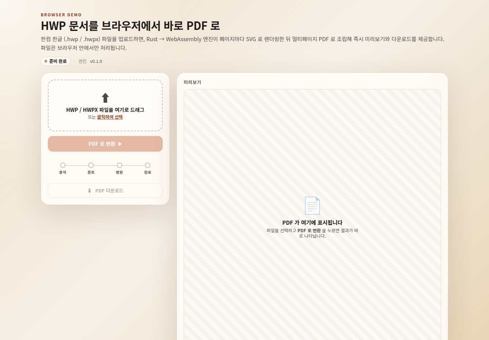

<h1 align="center">rhwptopdf</h1>

<p align="center">
  <strong>HWP / HWPX 를 브라우저에서 바로 PDF 로.</strong><br/>
  설치 없이, 업로드 없이, 오프라인에서.
</p>

<p align="center">
  <a href="https://github.com/sanguneo/rhwptopdf/actions/workflows/ci.yml">
    
  </a>
  <a href="https://sanguneo.github.io/rhwptopdf/">
    
  </a>
  <a href="https://github.com/sanguneo/rhwptopdf/releases">
    
  </a>
  <a href="https://opensource.org/licenses/MIT">
    
  </a>
  <a href="https://www.rust-lang.org/">
    
  </a>
  <a href="https://webassembly.org/">
    
  </a>
</p>

<p align="center">
  <strong>한국어</strong> · <a href="README_EN.md">English</a>
</p>

---

`rhwptopdf` 는 한컴 한글 문서 (`.hwp` / `.hwpx`) 를 **브라우저 안에서 그대로** PDF 로
바꿔 주는 WebAssembly 라이브러리입니다. 파일은 절대 외부 서버로 나가지 않고,
변환은 사용자의 브라우저에서만 일어납니다.

> 📺 **[온라인 데모](https://sanguneo.github.io/rhwptopdf/)** &nbsp;·&nbsp;
> 📦 **[GitHub Release](https://github.com/sanguneo/rhwptopdf/releases/latest)** &nbsp;·&nbsp;
> 📑 **[CHANGELOG](CHANGELOG.md)**

<p align="center">
  
</p>

## ✨ 핵심

- 🦀 **Rust → WebAssembly** — 단일 `.wasm` (6 MB) + UMD 번들 (16 KB)
- 📄 **multi-page PDF** — `svg2pdf` + `pdf-writer` 로 페이지마다 PDF 청크 조립
- 🎨 **vector glyph** — 글리프를 outline path 로 박아 어느 PDF 뷰어에서도 동일하게 보임
- 🅰️ **시스템 폰트 우선** — Chrome 105+ 의 `window.queryLocalFonts` 로 OS 한글 폰트 자동 사용, 미지원 시 번들된 한컴 폰트로 폴백 ()
- 🔒 **브라우저-only** — 파일 업로드 없음, 네트워크 round-trip 없음
- 🪶 **MIT** — 자체 코드는 MIT, 업스트림 `rhwp` 의 cherry-pick 모듈은 Apache-2.0 (`NOTICE` 보존)

## 🚀 빠른 시작

### 1. CDN `<script>` 한 줄

```html
<script src="https://github.com/sanguneo/rhwptopdf/releases/latest/download/rhwptopdf.umd.js"></script>
<script type="module">
  // 1) WASM 초기화
  await RhwpToPdf({ module_or_path: ".../rhwptopdf.umd_bg.wasm" });

  // 2) 변환용 폰트 등록 (필수 — 한 번씩)
  const ttf = new Uint8Array(await (await fetch("/fonts/HANBatang.ttf")).arrayBuffer());
  RhwpToPdf.registerPdfFont(ttf);

  // 3) HWP → PDF
  const hwpBytes = new Uint8Array(await file.arrayBuffer());
  const info     = RhwpToPdf.analyzeHwp(hwpBytes);   // { pageCount, fontsRequired }
  const pdfBytes = RhwpToPdf.hwpToPdf(hwpBytes);     // Uint8Array (multi-page PDF)
</script>
```

### 2. 로컬에서 데모 띄우기

```sh
git clone https://github.com/sanguneo/rhwptopdf
cd rhwptopdf/demo
npm start                 # http://127.0.0.1:8788
```

## 🔁 변환 파이프라인

페이지마다 5 단계로 PDF 한 페이지를 조립합니다:

```
┌──────────┐   ┌────────────┐   ┌────────────┐   ┌────────────┐   ┌────────────┐
│ HWP/HWPX │──▶│ SvgRenderer│──▶│ font-family│──▶│  usvg      │──▶│ pdf-writer │──▶ PDF
│  bytes   │   │ (96 dpi px)│   │ 정규화     │   │ text→path  │   │ page tree  │
└──────────┘   └────────────┘   └────────────┘   └────────────┘   └────────────┘
                    │                  │                │                  │
                    │                  │                ▼                  ▼
                    │                  │       fontdb (등록 폰트)    media_box = px × 72/96
                    ▼                  ▼
              SVG 한 페이지     serif / sans-serif
              (HWP 본문 +      generic 으로 단순화
               표 + 수식)
```

각 단계 요약:

1. **`SvgRenderer`** — HWP 페이지 (본문, 표, 도형, 수식) 를 96 dpi 픽셀 단위의 SVG 로
   렌더링.
2. **`font-family` 정규화** — SVG 안 모든 `font-family` 를 `serif` / `sans-serif` generic
   으로 치환 (`바탕` / `명조` / `궁서` → `serif`, `돋움` / `고딕` / `굴림` → `sans-serif`).
3. **`usvg` text-to-path** — fontdb 에 등록된 폰트의 글리프 outline 으로 텍스트를 path
   로 변환. fontdb 가 비어 있으면 글자가 안 보이므로 `registerPdfFont(bytes)` 를 미리
   호출해 둬야 합니다.
4. **`svg2pdf::to_chunk`** — SVG → PDF XObject 청크.
5. **`pdf-writer`** — 페이지마다 청크를 page tree 에 묶고, `media_box` 는 `px × 72/96 → pt`
   변환으로 A4 표준 사이즈 (`595 × 842 pt`) 가 되도록 맞춤.

> 글리프가 vector path 로 박혀 PDF 뷰어 환경에 상관없이 동일한 모양으로 보입니다.
> 다만 변환 시점에 fontdb 가 폰트 데이터를 가지고 있어야 하므로 호출자가
> `registerPdfFont(bytes)` 로 사용 폰트를 한 번씩 등록해야 합니다.

## 📚 API

```ts
// 진입점
function version(): string;
function analyzeHwp(bytes: Uint8Array): AnalyzeResult;  // { pageCount, fontsRequired }
function hwpToPdf(bytes: Uint8Array): Uint8Array;       // multi-page PDF 바이트

// 변환용 폰트 레지스트리
function registerPdfFont(bytes: Uint8Array): string;    // auto-detected family name
function clearPdfFonts(): void;
function pdfFontStatus(): string;                       // JSON debug

// 부가
function extractThumbnail(bytes: Uint8Array): unknown;  // PrvImage 만 가볍게 추출
```

JS-side 이벤트 wrapper (`demo/public/app.js` 의 `HwpToPdfJob`) 는 `progress` / `complete` /
`error` 이벤트를 발행하는 `EventTarget` 형태로 변환 라이프사이클을 캡슐화합니다.

## 🌱 Origin — rhwp 에서 출발

`rhwptopdf` 는 [`edwardkim/rhwp`](https://github.com/edwardkim/rhwp) (Apache-2.0) 의
HWP/HWPX parser + layout renderer 를 cherry-pick 한 **별개 트랙** 입니다.
업스트림 rhwp 가 "뷰어/에디터" 라면, 이 프로젝트는 그 위에 **PDF 출력 파이프라인**
한 가지를 얹은 minimal package 입니다.

```
2026-04   edwardkim/rhwp v0.7.x
            │ HWP 5.0 / HWPX 파서, 페이지네이션, SVG/Canvas 렌더
            │ (Apache-2.0)
            │
            ▼ parser/ + renderer/ 일부 cherry-pick
2026-05   rhwptopdf v0.1.0  ← 여기
            │ + svg2pdf + pdf-writer 로 multi-page PDF 조립
            │ + Font Access API 통합 (시스템 폰트 우선, 정적 fallback)
            │ + wasm-pack UMD 번들 + 브라우저 데모 (GitHub Pages)
            │ + 라이브러리 외 코드 (편집, 진단, CLI 도구 등) 슬림화
            │ (MIT — 단, NOTICE 의 rhwp Apache-2.0 attribution 보존)
            ▼
        브라우저-only HWP → PDF 변환기 ─ 단일 `.umd.js` + `.wasm`
```

상세한 변경 기록과 라이선스 의무는 [`NOTICE`](NOTICE) 를 참조하세요.

## 🛠️ 빌드

```sh
# 1) WASM cdylib 빌드
wasm-pack build --target no-modules --release --out-dir pkg-bundler --out-name rhwptopdf

# 2) wasm-bindgen 산출물 → UMD 번들로 wrap (window.RhwpToPdf 글로벌)
node scripts/wrap_umd.mjs pkg-bundler/rhwptopdf.js pkg-bundler/rhwptopdf.umd.js

# 3) UMD 가 로드할 .wasm 별칭
cp pkg-bundler/rhwptopdf_bg.wasm pkg-bundler/rhwptopdf.umd_bg.wasm
```

산출물:

| 파일 | 용도 | 크기 |
|---|---|---|
| `rhwptopdf.umd.js` | `window.RhwpToPdf` 글로벌 (UMD) | ~ 16 KB |
| `rhwptopdf.umd_bg.wasm` | 실행 WASM | ~ 6.1 MB |
| `rhwptopdf.d.ts` | TypeScript 타입 정의 | — |

## 📜 라이선스

- 본 프로젝트 (rhwptopdf) — **MIT**, © 2026 sanguneo. [`LICENSE`](LICENSE) 참조.
- 업스트림 [`edwardkim/rhwp`](https://github.com/edwardkim/rhwp) — **Apache License 2.0**,
  © Edward Kim and contributors. parser / renderer 모듈 일부 cherry-pick.

Apache-2.0 가 요구하는 attribution, 변경 기록, 라이선스 본문은 [`NOTICE`](NOTICE) 에
보존되어 있으며 재배포 (source / binary) 시 함께 유지해야 합니다 (Apache-2.0 § 4).
